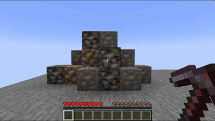
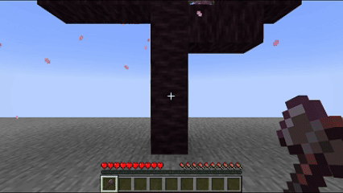

Mining in place
=======

一个简单的模组，能够在挖掘成片的同类方块（比如砍树和采矿）时将这片方块中最远的方块不断移动至挖掘位置，使得无需移动位置，站在原地即可一次挖完整片方块。
最终效果类似于各种连锁挖掘，但效率更贴近原版。各项配置可通过游戏内配置界面或配置文件修改。

灵感来源以及Fabric下的同功能模组：[一脉相挖](https://modrinth.com/mod/minepulse/)

### 效果展示

